# The Basics - Designing an LED Throwie

We're going to start with one of the simplest circuits for our first badge: a battery-powered LED.  It won't be the most exciting circuit board but will let us focus on all the steps in making the PCB without getting distracted by how the electronics work.

1. ## Installing Kicad

   Download the latest stable version of Kicad for your operating system from the [Kicad downloads page](http://kicad-pcb.org/download/).  You should make sure it is at least v5.1.5 (that's what all the example files are saved as, if you want to compare them)

1. ## Build the schematic

   Open Kicad

   Choose `File` -> `New` -> `Project...` and give it a name

   

   Double-click on the schematic file `.sch`.  The first time you run Kicad it might ask you to "Configure Global Symbol Library Table".  Choose the recommended option.

   

   You should now see the main blank Eeschema work area.  This is where you lay out the schematic of your circuit&mdash;the "tube map" version if you will.  It focuses on what connects to what, not on *where* each part will actually be.

   

   Select `Place power port` in the Tools on the Right for from `Place/Power Port` drop down menu.  For a simple circuit like an LED throwie this is a bit of an overkill, but it's a good habit to get into for more complex circuits.

   The power ports aren't things that will show up physically in your PCB, but ways to link common connections together without having to draw wires between them all, given how common it is to want to link something to GND, for example.  (You can do a similar thing with Labels too, if you want to define your own)

   

   Choose the `GND` Power flag, GND from the symbol list and then place it somewhere in the lower half of your schematic.  Don't worry too much about exactly where, you can always move it later if you need to.

   

   Then repeat the process to place a `+BATT` power port, somewhere in the upper half of your schematic.  You'll end up with something like this:

   

   Now we'll place the symbols that *will* translate into physical components on the finished PCB.

   Select `Place symbol` in the Tools on the Right or from `Place/Symbol` drop down menu and type `BATT` in the search window at the top.  Then choose the `Battery_Cell` symbol and place it in the work area

   

   Similarly, add the `LED` symbol to the work area

   

   Your work area should now look like this

   

   Now add the `R_Small` symbol to the work area

   

   Your work area should now look like this

   

   Next we need to wire up the circuit.

   Select the green `Place wire` in the Tools on the Right or from `Place/Wire` drop down menu

   

   Draw a line with the `Place wire` tool from the round end point footprint at the top of the passive resistor `R_Small` symbol to the `+BATT` symbol

   

   Draw a line with the `Place wire` tool from the round end point footprint of bottom of the passive resistor `R_Small` symbol to the top of the `LED` symbol

   

   Draw a wire from the round end point footprint of bottom of the `LED` symbol to the `GND` symbol

   

   Draw a wire from the round end point footprint of the `-` of the `Battery_Cell` symbol to the green wire connected to the `GND` symbol. This will generate a small green dot to show that this is a junction, and means the wires are connected at that point.  Wires that cross over *without* the green dot aren't connected together, but it's best to avoid that wherever possible.

   

   Draw a wire from the round end point footprint of the `+` of the `Battery_Cell` symbol to the green wire connected to the `+BATT` symbol. This will generate a junction.

   Now all of our schematic is wired up.

   

   We should set the properties of the components so that anyone reading it will know what sort of components to use.

   Double click on the `Battery_Cell` to edit the value field or right click and select `Properties/Edit Properties`

   

   Change the `Field Value` of the `Battery_Cell` to `CR2032`  

   

   Repeat the process for the resistor, and replace the `R_Small` value with the desired resistance value, in this case `560` ohms.

   The final step in creating the schematic is to annotate the components.  This will number them so that if, for example, you had a couple of LEDs on your schematic, you could differentiate between them.

   

   Click the `Annotate` button in the toolbar to bring up the annotations dialog box.  The default options will be fine, so go ahead and click the `Annotate` button.  And, assuming there are no errors in the messages box, then click `Close`.

   

   Your work area should look like this.  Note that the components now end with numbers rather than question marks.

   

1. ## Footprints and netlist

   Now the schematic is finished it's time to turn our attention to the physical layout of the PCB.

   First off we need to specify the physical shape of the components we're using: their *footprints*.  the footprints for components fall into two main classifications: *through hole* and *surface mount* (sometimes also referred to as *SMT* or *SMD*).

   Through hole components are probably what you're more familiar with.  They have legs that go *through* a *hole* in the PCB and you tend to solder them on the opposite of the PCB from the side the components sits on.

   Surface mount components are soldered to the same *surface* of the PCB that the component sits.  They are much more popular with mass-manufactured PCBs because the components are much easier to place automatically with a pick-and-place machine.  They can also be smaller because they don't need a hole big enough for a wire to pass through for each leg.  That's a good thing when you're designing a mobile phone and want it to be as small as possible, but can be a bit challenging if you're going to solder them by hand.

   However, more components are only available as surface mount, and if you're designing the PCB you can often avoid the hardest-to-hand-solder footprints, so for this example we'll run with surface mount.

   (If you *really* want to avoid surface mount then feel free to find through-hole alternatives&mdash;generally hunt through the `_THT` footprint libraries rather than the `_SMD` options&mdash;to the footprints on this board and use that for the remaining steps.  It will work just the same)

   We'll use these three components for our board:

   * CR2032 holder - [CPC BT06539](https://cpc.farnell.com/pro-power/pp002088/battery-holder-coin-cell-cr2032/dp/BT06539), which maps to Keystone 1060 in the standard Kicad `Battery` footprint library; 
   * An 0805 LED - there are many options to buy for these, so you can pick whatever colour takes your fancy.  The "0805" bit refers to the physical size of the LED: it's 8 hundredths-of-an-inch by 5 hundredths-of-an-inch (or 2x1.27mm in metric).  Picking the `HandSolder` option in the Kicad `LED_SMD` library will, unsurprisingly, make it easier to solder by hand.
   * An 0603 resistor.  Again the "0603" refers to the size, in hundredths-of-an-inch, so this is a bit smaller than the LED: 1.6x0.8mm.  I've found that these are fine, if a touch fiddly, to solder by hand&mdash;again, choose the `HandSolder` option in the Kicad `Resistor_SMD` library.

   Personally I don't pick anything smaller than 0603 if I'm doing the soldering.  There are 0402 and 0201 options, but you need a microscope and a *very* fine soldering iron for those.  If you're unsure of your soldering abilities, feel free to swap the LED and resistor options for 1206 or even 1812 versions.

   In the schematic, choose `Tools` -> `Assign Footprints...` from the menu.  That will open the `Assign Footprints` dialog.

   

   The first time you do this you will load up your footprints library. You may have to configure libraries for parts not included in your Kicad setup. 

   Choosing one of the libraries in the left-most column will bring up the list of available footprints in the right-most column.  (No, I don't know why they're either side of the list of components from the schematic either...)  Then pick the relevant component in the middle column and double-click the footprint you want in the right-most column to assign it.  Edit each entry in the list of components in the centre to match the footprints detailed in the list above.

   Once you've assigned them all, click `OK` to close the `Assign Footprints` dialog.

   The final task in the schematic editor is to generate the netlist.  From the menu, choose `Tools` -> `Generate Netlist File...`

   

   Click `Generate Netlist` and save it with the suggested name.

1. ## Lay out the PCB

   Now we'll move to `Pcbnew`, the program we use to define the physical layout of the PCB.

   Close the schematic editor, and in the main `Kicad` program click on the `Pcbnew` icon  or choose `Tools` -> `Edit PCB` from the menu.

   

   The first step is to import the netlist that we generated in the schematic editor.  This will tell Pcbnew what components there are and how they are wired to each other.

   Click on the `Load netlist` icon in the toolbar at the top of the screen  or choose `Tools` -> `Load Netlist...` from the menu.

   In the `Netlist` dialog, enter the location of the netlist file that you saved earlier.  (Clicking the browse folder icon should open in the right place with the netlist file as the only option.)  That will show the new components that it finds and that are ready to be loaded:

   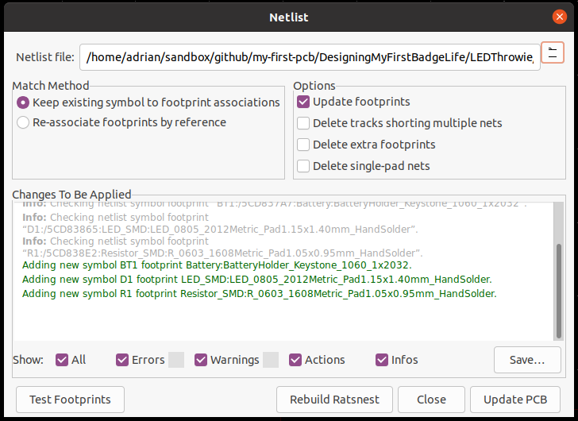

   Click `Update PCB` and the components will be added to the work area and then `Close` to close the dialog.

   You'll then be presented with a crosshairs where your mouse is, and the newly added components will move around as you move the mouse:

   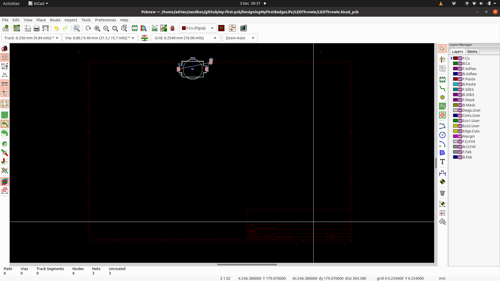

   Move the components to somewhere near the middle of the work area, and left-click to place them there.  Don't worry too much about the locations, we'll move them all in a moment.

   If we zoom in a bit, we'll see something like this:

   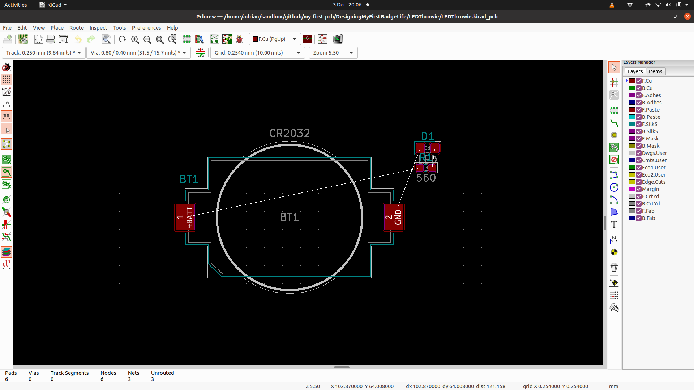

   There are the three components. Their pads are in dark red&mdash;these are the areas where the copper will be exposed to let you solder the components on.  And there are thin white lines showing which pads to connect to which&mdash;these **aren't** the wires, they're just showing where we'll need to draw wires later.  These white lines are known as the *ratsnest*.

   All of the components are on the top side of the board right now.  The battery should go on the back so it's not visible on the badge, so our first step will be to move to the other side of the board.

   Click somewhere inside the battery component to select it.  Then right click and choose `Properties...` from the menu or just type `e` to bring up its properties dialog:

   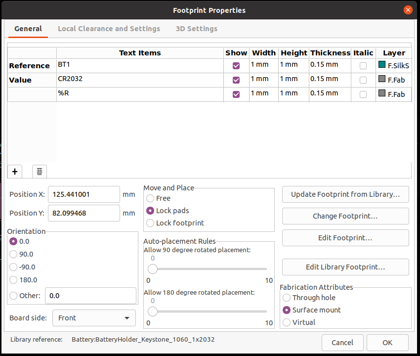

   In the bottom left you can see the `Board side` which is currently set to `Front`.  Change that to `Back` and then click `OK` to close the dialog.

   

   You'll see that the battery component is now flipped, with the text mirrored to show that it's on the back of the PCB.  Some of the colours have also changed: the pads are green to show that they're on the back copper `B.Cu` layer; and the `BT1` text is purple to show that it's now on the back silkscreen `B.SilkS` layer rather than the teal *front* silkscreen `F.SilkS` layer.

   Now we'll move the components to where we want them to live.

   > For this simple example it's fairly easy and we'll actually make it a bit more complicated than it needs to be, so we can try out *vias*.
   > 
   > My usual process for this step is to separate out groups of components into logical areas&mdash;the regulator and its smoothing capacitors, for example, over in one group; the amplifier chip, its resistors and capacitors, speaker connectors and potentiometer in another area...   That will give you little clusters of locals ratsnests with usually fewer wires connecting up the different groups.
   >
   > Then I can focus on laying out one of those clusters&mdash;moving and rotating components to minimize the number of wires in the ratsnest that cross over.  Then I can work through wiring things up locally, from the easy options through to the more difficult.  There'll often be little bits of reworking things when I realise one of the easy wires needs moving over a little or something similar.
   > 
   > As the local clusters get laid out, I can start to shuffle them around as complete units and line them up with each other to again reduce how much the wires between clusters cross over.  It should get easier as things progress as you'll have fewer and fewer of the white ratsnest wires to deal with.
   > 
   > I'll generally loop round that process a few times, with little bits of rework and re-jigging things each time, until I get everything in place.
   
   Move the components until they match the view here.  To move a component click on it and then type `m` or right-click and choose `Move` from the menu.  You'll see that `R1` has also been rotated&mdash;you can do that by typing `r` while the component is selected, and even while you're in the middle of moving it!  As I said, you'd normally try to avoid crossing the wires over like they are here.

   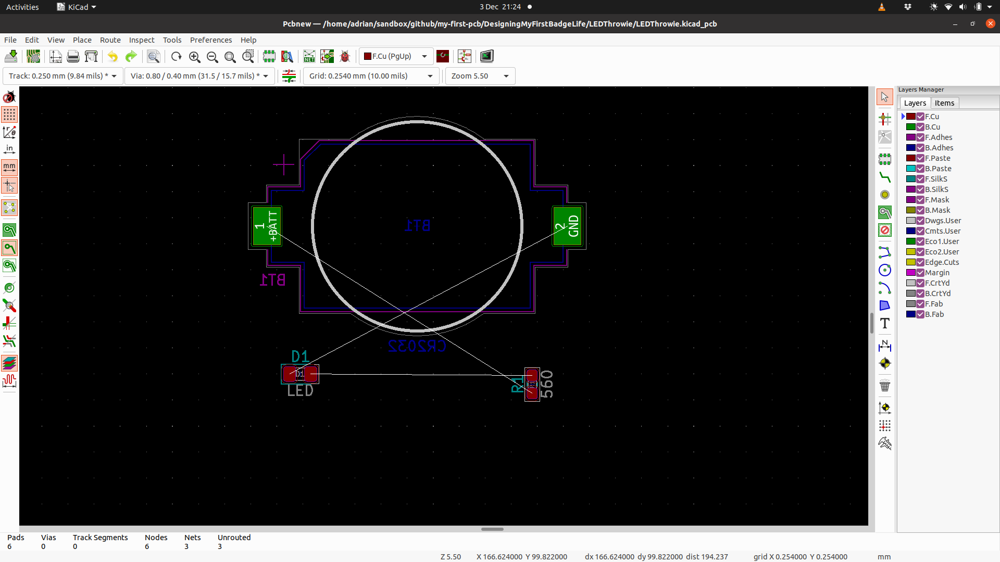

   Now we'll start drawing out the wires to connect the components up.

   Click on the `Route tracks` tool in the right-hand toolbar   

   Then click inside the `1 +BATT` pad on the battery.  That will start to draw out a track on the back copper (in green) to meet the mouse cursor.  Our target is the bottom pad of `R1`, which is on the front copper (in red) so we need to switch from one side of the board to the other.  We do that with a *via*, a tiny hole that's drilled through the board to connect one side to the other.  While we're drawing a track we can type `v` which will let us place a via on the board by left-clicking where we want it to be.  Then the colour of the track will swap to show that we're now laying out a track on the opposite side of the board.  Kicad will try to guess a suitable path for the track to take, but you can also click at various points along the track to have it follow a path that you define.

   When you finish routing the track over to `R1` and click into the bottom pad you'll have something like this:

   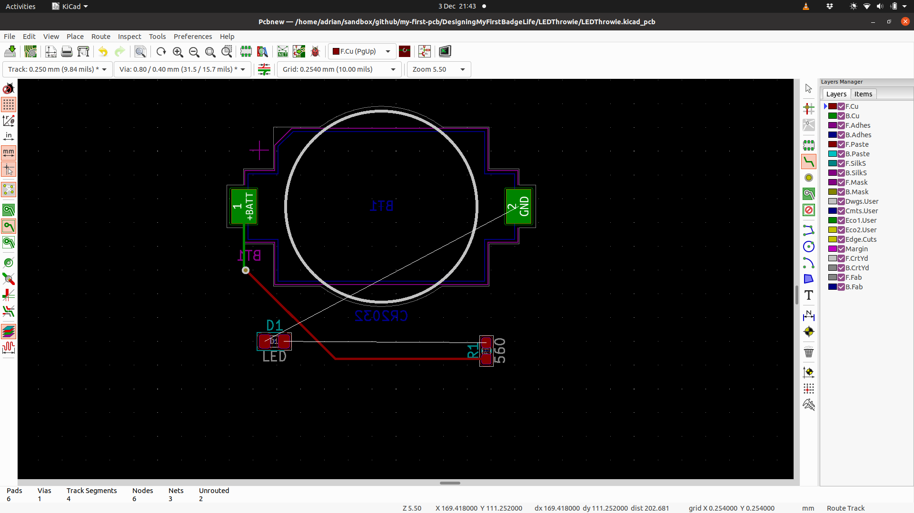

   If we follow the same process to route a track from the `2 GND` pad of the battery over to `D1`, with a via just above the pad on `D1` we'll have this.  You'll see that the two tracks cross over, but because they're on opposite sides of the board there isn't any conflict between them.

   

   The final track is between two pads on the same side of the board, so could be done without any vias.  If you try drawing a straight track from `D1` to `R1` you'll see that Kicad will automatically route the track around the one running from `R1` to the via on the track to the battery.  That's because it knows that those two tracks can't cross.

   The other option would be to use vias to bounce the track onto the opposite side of the board until it's past the `R1`&lt;-&gt;battery track.  That's what I've done in the version shown below.  There isn't a right or wrong answer for that, it depends on the situation you're trying to solve.

   

   That's all of the tracks routed, but there's one big thing we haven't done yet&mdash;we haven't defined how big the PCB itself is!

   To do that we first need to switch the layer that we're working on.  On the top toolbar you'll see this drop-down menu  which is probably set to `F.Cu` for the front copper.  If you click on that and select the `Edge.Cuts` layer then we'll be able to draw in the edges of our PCB.

   The graphic tools in the right-hand toolbar will let us draw out the edge of the PCB:

   

   For some variety I've gone with a circle:

   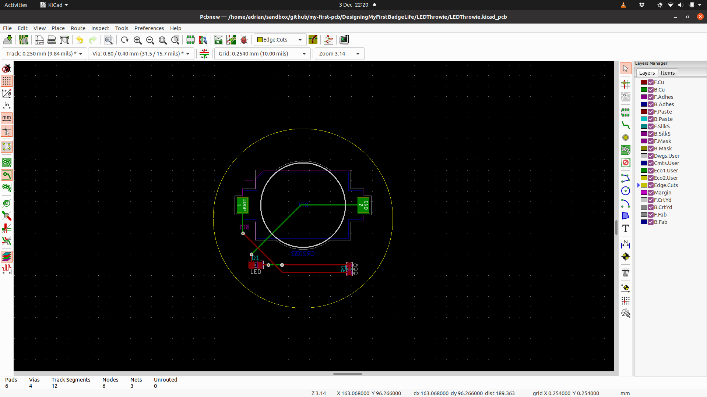

   You can use the graphic tools on other layers too.  We can select the `F.SilkS` layer and add some text...

   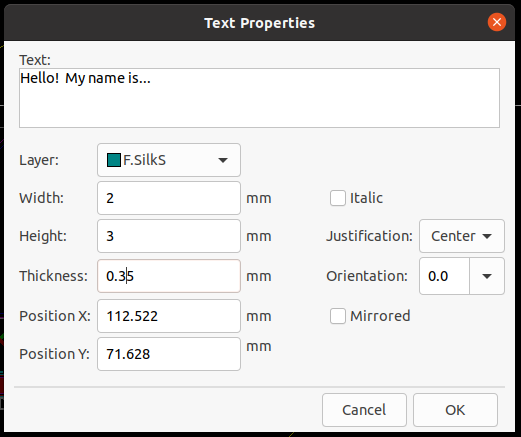

   And then a graphic polygon:

   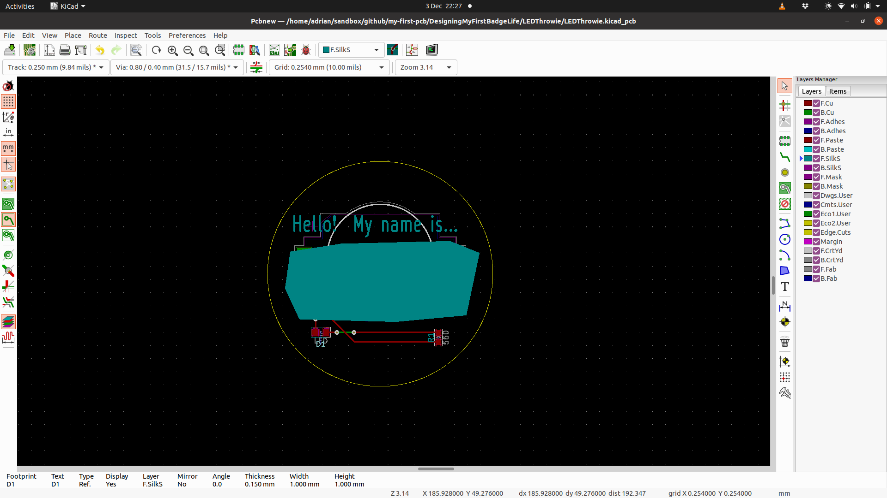

   It would be useful to have somewhere to attach a lanyard to our badge.  We can use some mounting holes for that.

   Choose the `Add footprints` tool on the right hand side  and click where you want to add the mounting hole.  When the `Choose Footprint` dialog opens, find the `MountingHole` library in the list and double-click on it to expand it.

   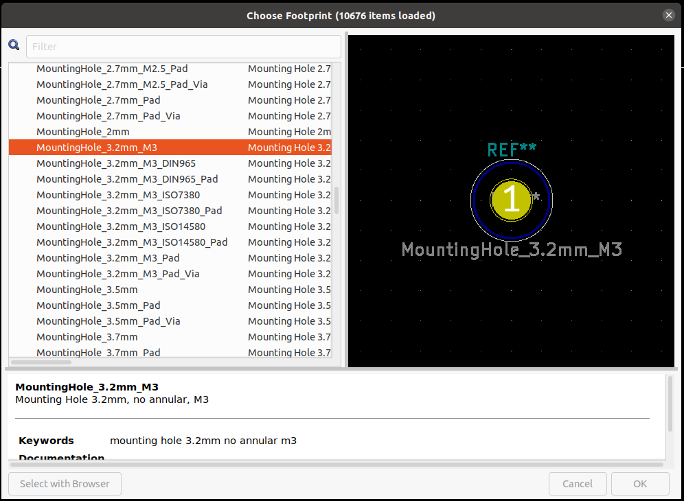

   Choose `MountingHole_3.2mm_M3` and click `OK`.  Position the hole in the top left corner of the board, and then add another in the top right corner.

   

   You'll see there that there are two instances of `REF**` on the front silkscreen that don't fit inside the board edges.  We don't want that text at all, so select it (just the `REF**` text, not the entire mounting hole) and type `e` to open its properties dialog.  Then you can untick the `Visible` checkbox and hit `OK` and the text will be removed from the board.  Repeat the process for the second `REF**` text.

   

   We should add some more details to the back silkscreen too.  The WEEE logo to remind people to dispose of their badge responsibly, maybe an open hardware logo too...

   You can add them in the same way as we did for the mounting holes, but looking in the `Symbol` library and adding both `OSHW-Logo2_7.3x6mm_SilkScreen` and `WEEE-Logo_4.2x6mm_SilkScreen`.  When you first add them they'll be placed onto the *front* silkscreen, so you'll need to edit their properties to move them to the back of the board.

   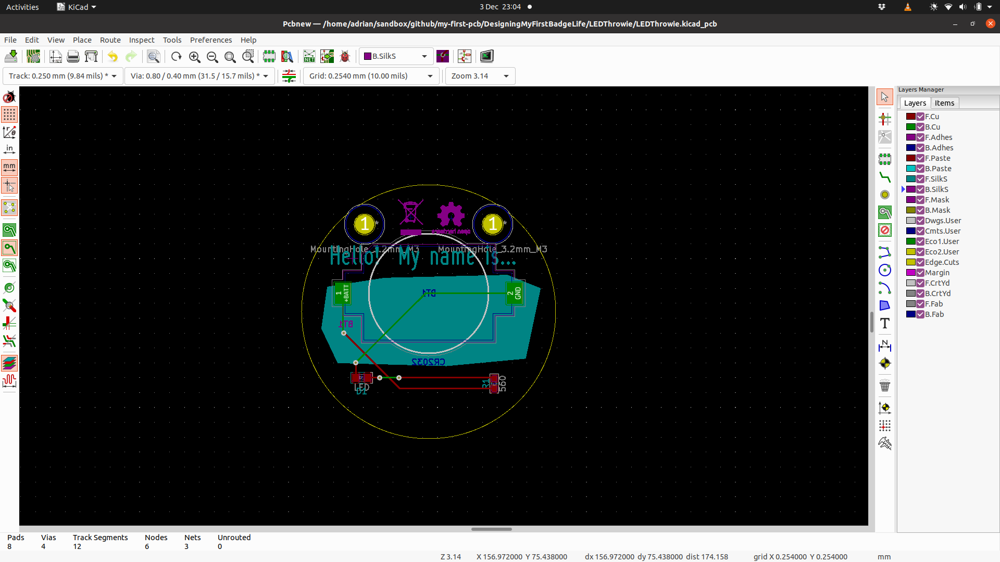

   A link to more information and a revision number are also useful; the first so that other people can find out more about the badge, and the second so that you can tell exactly which version of the board you're holding when you get to making newer versions of it.

   If you're finding the board a bit cluttered to work on now, you can hide one or more of the layers to reduce the amount of information shown on screen.  For example, the front silkscreen dominates with that big graphic polygon, so it might be easier to hide it while working on the back silkscreen.  You can do that by unticking that layer in the `Layers Manager` list on the right hand side.

   

   I've added the URL for this course and a revision number of `r20201203` here.  I usually use the date that I'm making the board as the revision number, then I don't have to remember exactly which version I'm up to...  The front silkscreen is also hidden in this screenshot:

   

   This circuit is unlikely to generate any stray radio signals, but it's good practice in general to add a copper fill across the board that's connected to ground to provide a path to ground for them.  You can also use this technique to provide larger areas of copper to act as a heatsink on regulators, MOSFets or similar chips (it's the sort of thing that's detailed in the datasheet for a chip if it's important).

   Choose the `Add filled zones` tool  from the toolbar on the right hand side, or via the `Place` -> `Zone` menu.

   Then click in the top left corner of the board.  If the zone is outside the edge of the board it will automatically get trimmed to the edge so here, where we just want to flood any spare room on the board with copper, we can actually draw a simple box round to outside of the board edges.

   Your first click, as well as defining the start of your zone polygon, will bring up the `Copper Zone Properties` dialog.  Choose the side of the board you want to fill, in this case the back copper `B.Cu`, and then which part of the circuit&mdash;the `Net`&mdash;that should be connected to it.  We want to connect it to ground, so choose `GND`.  If you were drawing a zone to connect to a MOSFET or something then you'd find the appropriate pad connection in the list of nets.  You can leave the rest of the settings as the defaults, and click `OK`.

   

   Now draw out the rest of the zone, clicking on each corner.  To finish drawing the zone, double-click on the last corner.

   It won't be immediately obvious that anything has changed, other than there being a box with green hashed lines round your design.  That's because the default view doesn't show the filled in copper because it makes it harder to see other parts of the design.  Clicking on the filled zone view options in the left hand toolbar will let you choose between the default (not shown); fully filled in; or the edge of the zone drawn in.

   

   With the view set to `Show filled areas in zones` it will now look like this:

   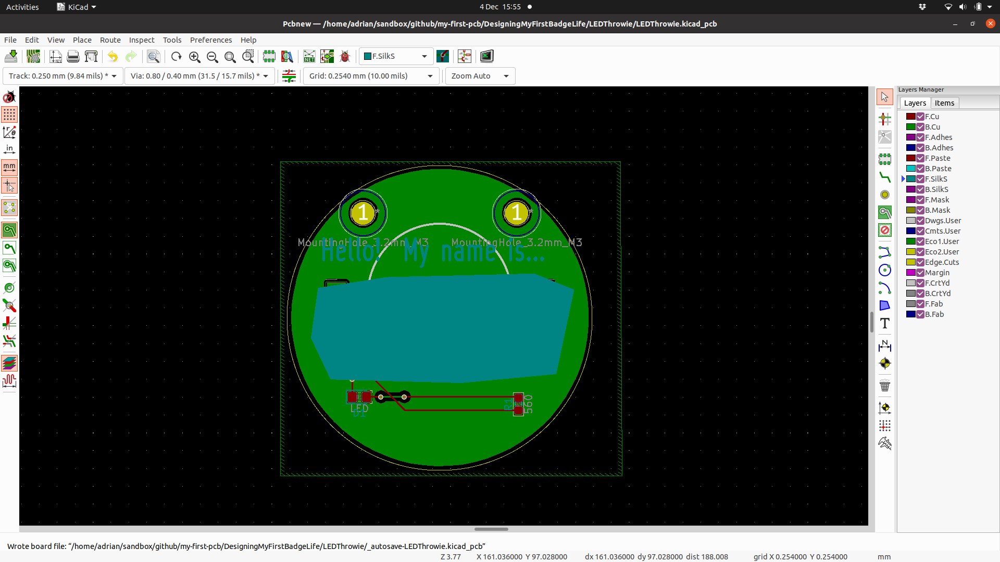

   That's our board all finished now.  The final step before we move to production is to run the `Design Rules Check` or `DRC`.  This gets Kicad to check over the design and check that you've remembered to add tracks for all the connections and that you haven't placed any components too close to each other, made any tracks too thin... that sort of thing.

   Click the `DRC` tool icon  in the top toolbar or choose `Inspect` -> `Design Rules Checker` from the menu.  That will open the design rule checker.

   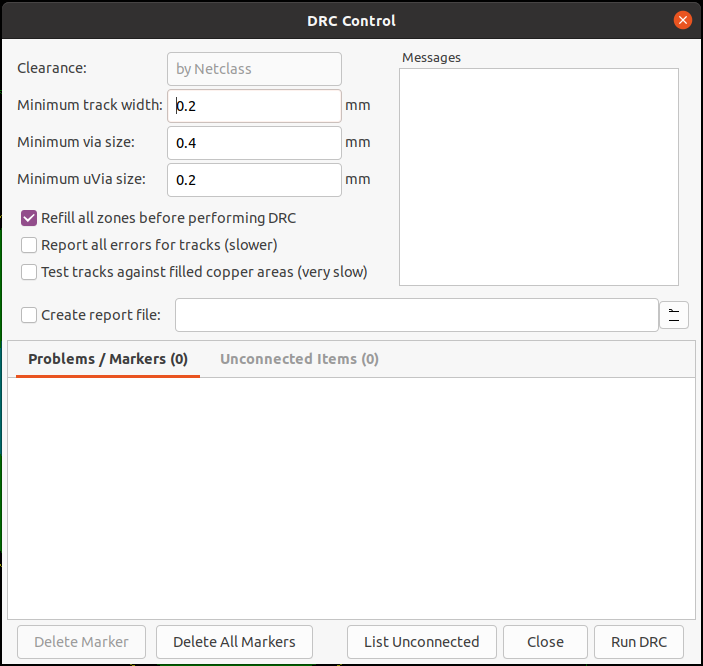

   Your PCB house (i.e. the place who you're getting to make your PCBs for you) will usually have a list of the capabilities of their manufacuring processes: how fine the tracks can be, the smallest size of vias, etc.  These are the "design rules" that we're now going to check.  When you get onto more comlex and detailed designs you might need to pay more attention to the exact settings here, but for beginner designs the Kicad defaults should be well within anything your PCB house can make, so we can leave the various settings at their defaults.

   Click `Run DRC` to perform the check, and then see if it finds any problems.  Remember to check the `Unconnected Items` tab too&mdash;I've been caught out by not spotting something lying in there before!

   You should fix any problems it finds, and then re-run the check until you get the all clear like here:

   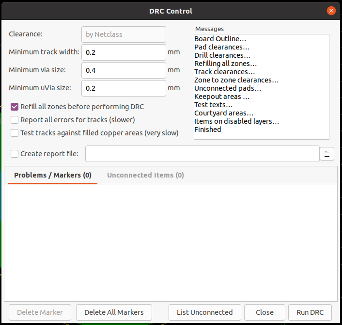

1. ## Getting physical boards

   It's time to take your design and turn it into actual physical PCBs!

   You could make them yourself by etching or milling them on a CNC mill, but that doesn't give you any soldermask (to protect any of the bare copper tracks) or plating on the through holes (which makes double-sided boards more hassle as there's no connection from one side to the other).

   These days there are many online PCB services which are stupidly cheap, so providing you can wait a week or two for the PCBs to arrive, it's not worth making the boards yourself.

   For small numbers of boards, I tend to use either [JLC PCB](https://jlcpcb.com/) in China or [OSHPark](https://oshpark.com/) in the US.  They're both really good services.  When I'm ordering more, or need a quicker turn-around or need UK manufacturing, [European Circuits](https://european-circuits.co.uk/) up in Glasgow are great.  Their pricing has a set-up fee, which means it's not as competitve for small orders but once you're getting 50+ boards it's less of an issue.

   For any of the services, you'll need to generate a set of Gerber files.  This is the standard format that all PCB houses use.  Some of them will let you upload your Kicad files now, but I tend to stick with the tried-and-tested Gerbers.

   To generate them, open your design in `Pcbnew` and then choose `File` -> `Plot...` from the menu, which will open the `Plot` dialog:

   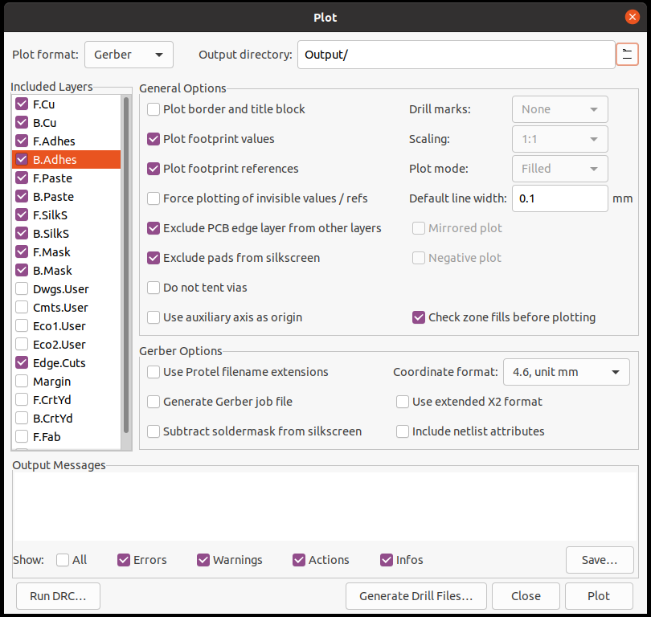

   I usually create a new folder for the `Output directory` so that it's easy to see which files get created&mdash;generally called "Output" and in the same folder as the Kicad project itself, but feel free to choose anywhere that makes sense to you.

   Then you need to choose the layers to plot in the `Included Layers` list.  This list: F.Cu, B.Cu, F.Adhes, B.Adhes, F.Paste, B.Paste, F.SilkS, B.SilkS, F.Mask, B.Mask and Edge.Cuts is my standard list.  If you're not sure whether or not to include something, lean towards including it as the PCB houses are pretty good at knowing which is which and ignoring the layers they don't care about.

   The default options for the rest are fine, and obviously the `Plot format` should be `Gerber`.  Clicking `Plot` will generate the files&mdash;one for each layer&mdash;and list them in the `Output Messages` area.

   Before you close the `Plot` dialog we also need to generate the drill files.  Click `Generate Drill Files...` to open that diaglog:

   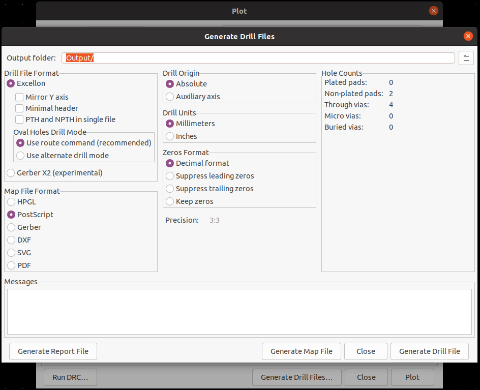

   The `Output folder` should be the same as the one we used when plotting the Gerber files, and againthe default options as shown here should be okay.  Click `Generate Drill File` to create the necessary drill files.

   Now close the dialog boxes and Pcbnew.  Then find the files you just generated, and combine them all into a zip file.  This is what you'll upload to the PCB service when you're ordering your boards.

   There aren't any particular gotchas when ordering the boards&mdash;you can choose the colour of solder mask based on your personal preferences, and for other options the PCB house's defaults will be fine for this level of board.  If you're thinking of using solder paste and a hotplate or reflow oven to solder the components on, rather than a soldering iron, then it's worth ordering a PCB stencil at the same time as your PCB.

   Well done, you've got your first PCB designed and ready to order!
